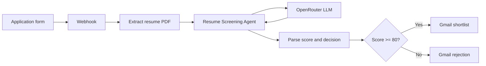
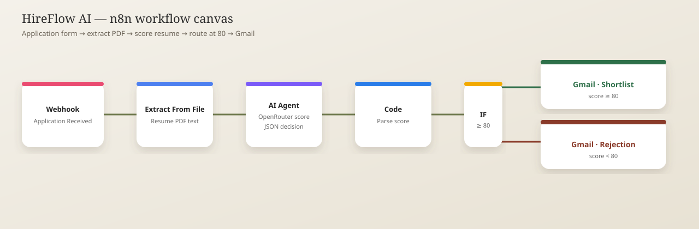
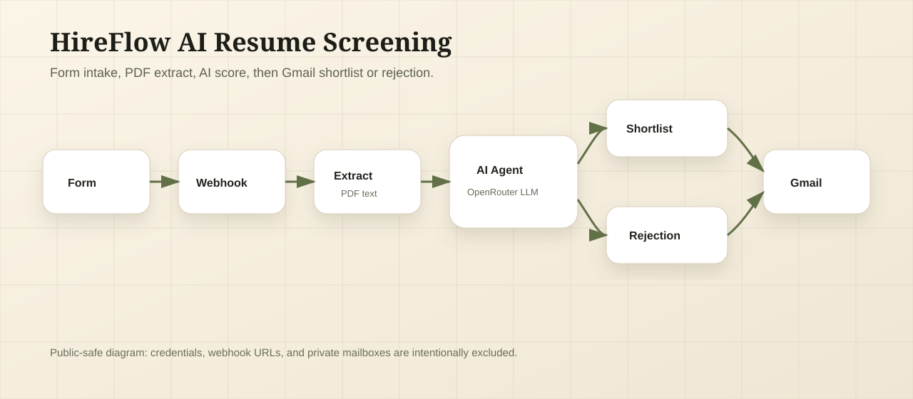
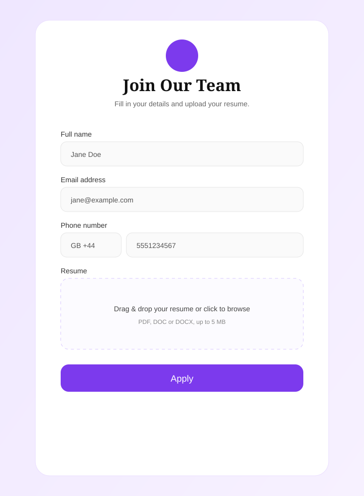
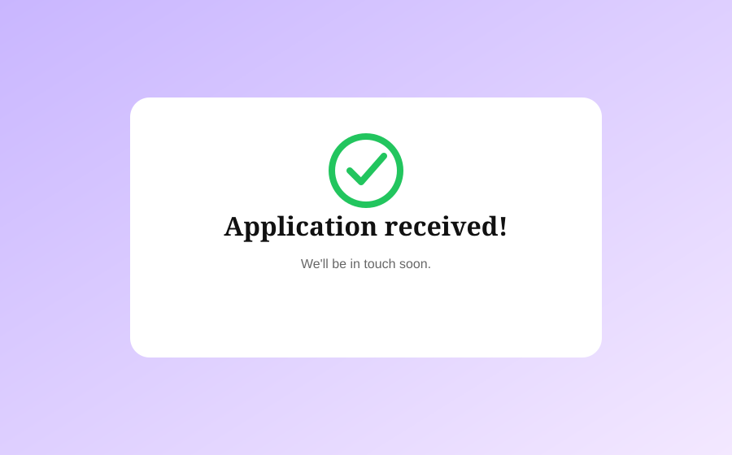
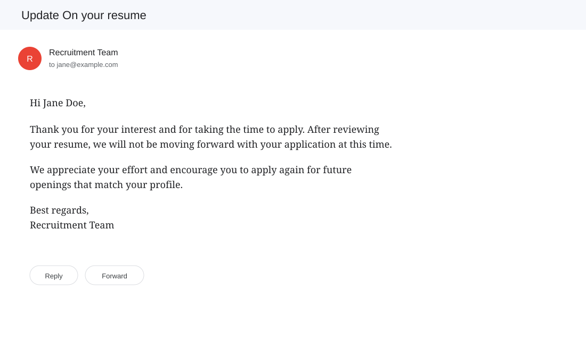

# HireFlow AI Resume Screening

An n8n automation that screens job applications with an AI agent and sends a shortlist or rejection email through Gmail.

This portfolio project shows how a hiring team can collect a resume from a web form, extract the PDF text, score the candidate against a configurable job prompt, and reply automatically without opening every file by hand.

> Portfolio note: this is a public demo project. The workflow export is scrubbed and uses placeholder credentials and a placeholder webhook path.

## Demo



The demo cycles through the live recording stages: form submit (PII covered), application received, n8n workflow executing, and the Gmail candidate email.

## What It Does

- Receives a candidate name, email, phone, and resume from a public form.
- Triggers an n8n webhook with the uploaded PDF.
- Extracts resume text from the PDF.
- Scores the resume with an AI screening agent on OpenRouter.
- Parses `total_score` and `decision` from the model output.
- Routes the candidate with an IF node at a threshold of 80.
- Sends a shortlist email or a rejection email through Gmail.

## Business Use Case

Recruiters spend time opening every PDF, checking basic qualifications, and sending the same two emails. This workflow reduces that first-pass work by connecting the application form directly to an AI score and a Gmail reply.

It is useful for:

| Team / Business | Why It Fits |
|---|---|
| Recruiters and talent teams | First-pass scoring and candidate emails happen without opening every PDF |
| Startup hiring managers | One form and one workflow can screen inbound applications for an open role |
| Recruiting agencies | The prompt can be swapped per client job without rebuilding the pipeline |
| HR operations | Rejection and shortlist messages stay consistent |
| Automation portfolios | Demonstrates webhook + file extract + AI agent + IF routing + Gmail |

## Architecture



## Screenshots

### n8n Workflow Canvas

This is the live n8n canvas from the working automation.



### Public-Safe Architecture



## Evidence

### Application Form

The published form uses fictional demo values only.



### Application Received



### Gmail Candidate Email



## Workflow Logic

| Step | Node | Purpose |
|---|---|---|
| 1 | Application Received (Webhook) | Receives the form POST with candidate fields and resume file |
| 2 | Extract Resume Text | Pulls raw text from the uploaded PDF |
| 3 | Resume Screening Agent | Scores the resume against the job prompt |
| 4 | LLM - OpenRouter | Provides the language model for the agent |
| 5 | Parse Score & Decision | Cleans model output into `score` and `decision` |
| 6 | Score >= 80 Check | Routes shortlist vs rejection |
| 7 | Send Shortlist Email | Emails the candidate when the score clears the threshold |
| 8 | Send Rejection Email | Emails the candidate when the score is below the threshold |

## Sample Data

The repository includes fabricated/test files:

- [sample-application.json](sample-data/sample-application.json)
- [sample-ai-output.json](sample-data/sample-ai-output.json)
- [sample-shortlist-email.html](sample-data/sample-shortlist-email.html)
- [sample-rejection-email.html](sample-data/sample-rejection-email.html)

## Tech Stack

| Area | Tools |
|---|---|
| Automation | n8n |
| Application intake | HTML / CSS / JS form + webhook |
| File parsing | n8n Extract From File |
| AI model | LLM via OpenRouter |
| Routing | n8n IF node |
| Notifications | Gmail |
| Documentation | Markdown, sanitized workflow export, sample JSON/HTML |

## Repository Structure

```text
.
|-- demo/
|   `-- hireflow-ai-demo-redacted.svg
|-- docs/
|   |-- SECURITY.md
|   `-- SETUP.md
|-- sample-data/
|   |-- sample-ai-output.json
|   |-- sample-application.json
|   |-- sample-rejection-email.html
|   `-- sample-shortlist-email.html
|-- screenshots/
|   |-- application-form-demo.svg
|   |-- application-received-success.svg
|   |-- gmail-rejection-redacted.svg
|   |-- n8n-workflow-canvas.svg
|   `-- public-safe-architecture.svg
|-- workflow.json
|-- .gitignore
|-- LICENSE
`-- README.md
```

## Setup

Full setup instructions are available in [docs/SETUP.md](docs/SETUP.md).

Short version:

1. Import `workflow.json` into n8n.
2. Replace all `YOUR_...` placeholders with your own OpenRouter and Gmail credentials.
3. Point the application form to your webhook URL.
4. Edit the role, skills, minimum qualification, and threshold in the Resume Screening Agent prompt.
5. Test with one strong resume and one weak resume.
6. Confirm the output in Gmail.

## Security And Privacy

This public repository is sanitized for portfolio use:

- API keys are not included.
- OAuth tokens are not included.
- Gmail credential IDs are replaced with placeholders.
- Webhook path and webhook ID are replaced with placeholders.
- n8n instance IDs are removed.
- Screenshots use fabricated names and emails.

More detail is available in [docs/SECURITY.md](docs/SECURITY.md).

## Limitations

- This is a portfolio demo, not a production applicant tracking system.
- It does not store applications in a database or provide a recruiter dashboard.
- It does not include form authentication, rate limiting, or malware scanning of uploads.
- The AI score should be reviewed before using it with real candidates.

## Future Improvements

- Save every application and score to Airtable or Google Sheets.
- Add human approval before shortlist emails are sent.
- Add DOC/DOCX extraction in addition to PDF.
- Add multilingual screening prompts.
- Add a recruiter digest instead of only candidate-facing email.

## What This Project Demonstrates

- Building an AI screening agent around a real hiring workflow.
- Connecting a public form, PDF extraction, OpenRouter, and Gmail inside n8n.
- Parsing structured AI output before routing.
- Keeping job criteria in a prompt the hiring team can edit.
- Separating public portfolio exports from private credentials.
- Documenting an automation project in a recruiter-friendly way.

## Author

Built by **Akshay ALLAM**.

## License

MIT - free to use, modify, and share. See [LICENSE](LICENSE).
