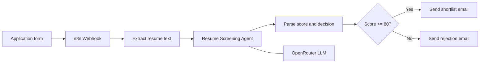

# HireFlow AI — Automated Resume Screening

An AI-powered recruitment screening workflow built with **n8n**, **OpenRouter**, **Gmail**, and a public application form.

A candidate submits a resume through a web form. n8n extracts the PDF text, an AI screening agent scores the resume against a configurable job prompt, and Gmail sends either a shortlist email or a rejection email.

> This is a portfolio automation demo. It is not presented as an enterprise ATS platform. Screenshots and sample records are redacted or fabricated, and the workflow export is scrubbed for public GitHub use.

## Demo


The demo shows the application form being submitted, the n8n workflow executing node by node, and the success state returned to the candidate. Personal fields in the live recording are covered before publishing.

## What It Does

The workflow receives an application, reads the uploaded resume, asks an LLM to return a structured score, then routes the candidate:

- **score >= 80** → shortlist email
- **score < 80** → rejection email

The threshold and the job criteria live in the AI agent prompt, so the same pipeline can be reused for a different role by editing one section.

## Problem

Recruiters spend time opening every PDF, checking basic qualifications, and sending the same two emails. First-pass screening is repetitive, easy to delay, and hard to keep consistent across candidates.

## Solution

HireFlow AI creates a first-pass screening layer:

1. Collect name, email, phone, and resume from a public form.
2. Send the payload to an n8n webhook.
3. Extract text from the uploaded PDF.
4. Score the resume with an AI recruiter agent.
5. Parse `total_score` and `decision` from the model output.
6. Email the candidate automatically through Gmail.

## Use Case

The workflow is useful when a team receives more applications than it can review by hand and wants a consistent first decision before a human looks at the shortlist.

Typical uses include internship intake, junior developer hiring, operations roles, and any posting where the must-have skills can be written into a prompt.

## Who This Works For

| Team | Why It Fits |
|---|---|
| Recruiters and talent teams | First-pass scoring and candidate emails happen without opening every PDF. |
| Startup hiring managers | A single form and workflow can screen inbound applications for one open role. |
| Agencies | The prompt can be swapped per client job without rebuilding the pipeline. |
| Operations / HR ops | Rejection and shortlist messages stay consistent and timestamped in Gmail. |
| Automation builders | Shows webhook + file extract + AI agent + IF routing + Gmail in one flow. |

The workflow is useful when a team wants AI assistance for screening, but still keeps the job criteria explicit in a prompt they control.

## Architecture



## Screenshots

### Application Form

The published form screenshot uses fictional demo values only.


### Application Received


### n8n Workflow Canvas


### Workflow Execution


### Rejection Email Example

The Gmail screenshot uses a fabricated recipient. No live inbox addresses are published.


## Tech Stack

| Area | Tools |
|---|---|
| Frontend | HTML / CSS / JS application form |
| Automation | n8n (self-hosted) |
| File parsing | n8n Extract From File |
| AI model | LLM via OpenRouter |
| Routing | IF node on parsed score |
| Email | Gmail OAuth2 |
| Public access | Cloudflare Tunnel or any public webhook URL |

## Workflow Logic

| Step | Node | Purpose |
|---|---|---|
| 1 | Application Received (Webhook) | Accepts POST with candidate fields and resume file |
| 2 | Extract Resume Text | Pulls raw text from the uploaded PDF |
| 3 | Resume Screening Agent | Scores the resume against the job prompt |
| 4 | LLM - OpenRouter | Provides the language model for the agent |
| 5 | Parse Score & Decision | Cleans model output into `score` and `decision` |
| 6 | Score >= 80 Check | Routes shortlist vs rejection |
| 7 | Send Shortlist Email | Emails the candidate when the score clears the threshold |
| 8 | Send Rejection Email | Emails the candidate when the score is below the threshold |

## Important Design Decision

The AI must score only what is written in the resume.

It does not search the web, it does not invent employers or degrees, and a missing minimum qualification forces a disqualified result. The Code node exists so the IF node receives numbers, not free-text.

The public export uses `gte` (greater than or equal) for the threshold check so the node matches the documented `>= 80` behavior.

## Example Request

The form should POST multipart data to the webhook. Conceptual payload:

```json
{
  "name": "Jane Doe",
  "email": "jane@example.com",
  "phone": "+44 5551234567",
  "resume": "(binary PDF file field named resume)"
}
```

## Example AI Output

```json
{
  "has_min_qualification": true,
  "projects_score": 22,
  "experience_score": 18,
  "skills_score": 12,
  "clarity_score": 10,
  "total_score": 62,
  "decision": "DISQUALIFIED",
  "summary": "The resume shows some relevant coursework but limited evidence of production automation work. Core required skills are mentioned as a list rather than demonstrated in projects."
}
```

## Sample Data

- [Sample webhook fields](sample-data/sample-application.json)
- [Sample AI output](sample-data/sample-ai-output.json)
- [Sample shortlist email](sample-data/sample-shortlist-email.html)
- [Sample rejection email](sample-data/sample-rejection-email.html)

All names, emails, and phone numbers in sample files are fabricated.

## Folder Structure

```text
hireflow-ai-resume-screening/
|-- README.md
|-- LICENSE
|-- .gitignore
|-- workflow.json
|-- demo/
|   `-- hireflow-ai-demo-redacted.gif
|-- docs/
|   |-- SECURITY.md
|   `-- SETUP.md
|-- sample-data/
|   |-- sample-ai-output.json
|   |-- sample-application.json
|   |-- sample-rejection-email.html
|   `-- sample-shortlist-email.html
`-- screenshots/
    |-- application-form-demo.jpg
    |-- application-received-success.png
    |-- gmail-rejection-redacted.jpg
    |-- n8n-workflow-canvas.png
    `-- n8n-workflow-executing.png
```

## Setup

Full setup instructions are available in [docs/SETUP.md](docs/SETUP.md).

Short version:

1. Import `workflow.json` into n8n.
2. Create your own OpenRouter and Gmail credentials inside n8n.
3. Point the application form to your webhook URL.
4. Edit the role, skills, and threshold in the Resume Screening Agent prompt.
5. Submit a test PDF and confirm both email paths.

## Security And Privacy

The public workflow export is scrubbed:

- credential IDs replaced with `YOUR_CREDENTIAL_ID`
- credential names replaced with `YOUR_CREDENTIAL_NAME`
- webhook path and webhook ID replaced with placeholders
- n8n instance ID removed
- no API keys or OAuth tokens included
- sample data is fictional
- demo GIF covers personal form fields from the original recording

See [docs/SECURITY.md](docs/SECURITY.md) for the review checklist.

## Limitations

- This is a portfolio demo, not a full applicant tracking system.
- It does not store applications in a database or provide a recruiter dashboard.
- It does not include authentication on the public form, rate limiting, or malware scanning of uploads.
- Email quality and score quality depend on the prompt, the model, and the resume text extraction.
- The original live form and Cloudflare tunnel URL are not included.

## Future Improvements

- Save every application and score to Airtable or Google Sheets.
- Add a human approval step before shortlist emails are sent.
- Support DOC/DOCX extraction in addition to PDF.
- Add multilingual screening prompts.
- Add a recruiter digest instead of only candidate-facing email.

## What This Project Demonstrates

- Webhook intake from a public application form
- PDF text extraction inside n8n
- Prompt-configured AI screening with structured JSON output
- Defensive parsing of LLM output in a Code node
- Conditional routing for shortlist vs rejection
- Gmail automation for candidate communication
- Self-hosted n8n thinking with a public webhook
- Credential hygiene through scrubbed exports and redacted media

## Author

Built by **Akshay Allam**.

## License

MIT License.
